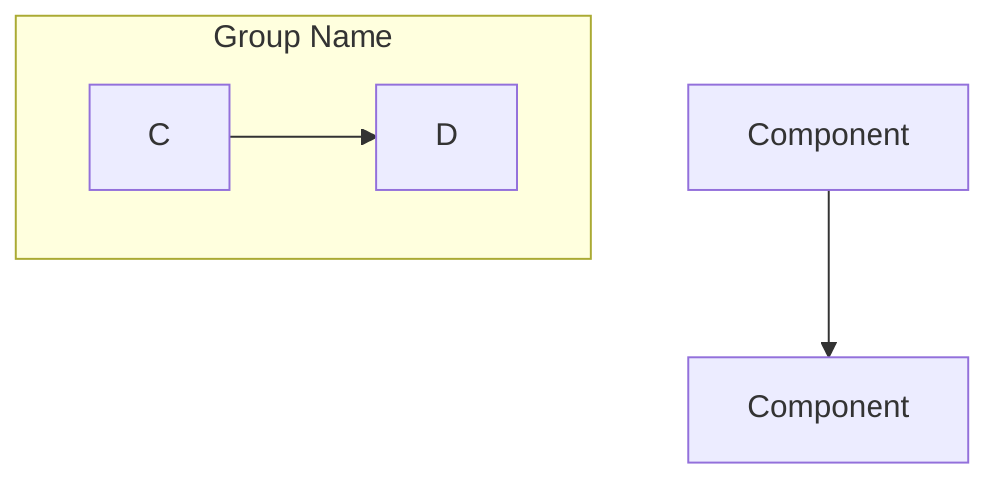
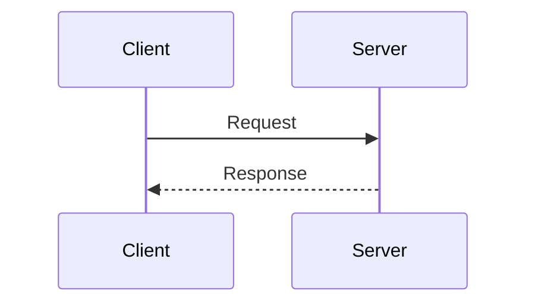
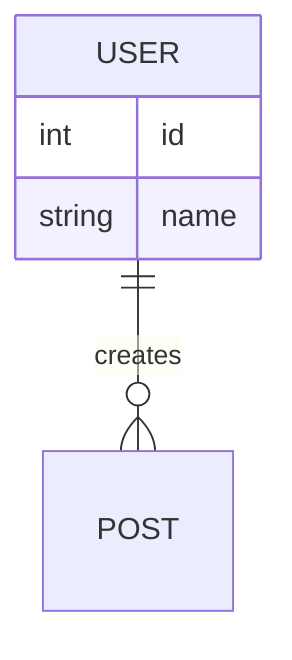

# Mermaid Diagram Skill

Use this skill for creating, validating, and rendering Mermaid diagrams in documentation.

## When to Use

- Creating architecture diagrams
- Validating Mermaid syntax before committing
- Rendering diagrams to PNG for preview
- Troubleshooting diagram rendering issues

## Prerequisites

Install mermaid-cli globally:

```bash
npm install -g @mermaid-js/mermaid-cli
```

Verify installation:

```bash
mmdc --version
```

## Validation Workflow

### 1. Write Diagram File

Use the **Write tool** to create `.mmd` files directly:

```
Write tool → /tmp/diagram.mmd
Content:
flowchart TD
    A --> B
```

This avoids needing `cat` or `echo` Bash permissions.

### 2. Validate and Render

```bash
mmdc --input /tmp/diagram.mmd --output /tmp/diagram.png
```

- **Success**: "Generating single mermaid chart"
- **Failure**: Error message shows syntax issues

### 3. Preview Rendered Output

Use the **Read tool** on `/tmp/diagram.png` to visually verify the diagram.

## Diagram Types Reference

### Flowchart (Architecture, System Overview)



Direction options: `TD` (top-down), `LR` (left-right), `BT` (bottom-top), `RL` (right-left)

### Sequence Diagram (Request Flow, API Calls)



### Entity Relationship (Data Models)



## Common Syntax Issues

| Issue | Wrong | Correct |
|-------|-------|---------|
| Special chars in labels | `A[Label: value]` | `A["Label: value"]` |
| Newlines in labels | `A[Line1\nLine2]` | `A["Line1<br/>Line2"]` |
| Subgraph naming | `subgraph Name` | `subgraph Name["Display Name"]` |
| Empty nodes | `A[]` | `A[" "]` or `A[Label]` |

## MkDocs Integration

Ensure `mkdocs.yml` has Mermaid support:

```yaml
markdown_extensions:
  - pymdownx.superfences:
      custom_fences:
        - name: mermaid
          class: mermaid
          format: !!python/name:pymdownx.superfences.fence_code_format
```

## Tips

- Use `"quotes"` around labels with special characters
- Use `<br/>` for line breaks within labels
- Test complex diagrams incrementally
- Use the Read tool on PNG output for visual verification
- Use `[(Database)]` for cylinder shapes, `([Stadium])` for stadium shapes
- Write tool for .mmd files avoids Bash permission prompts
