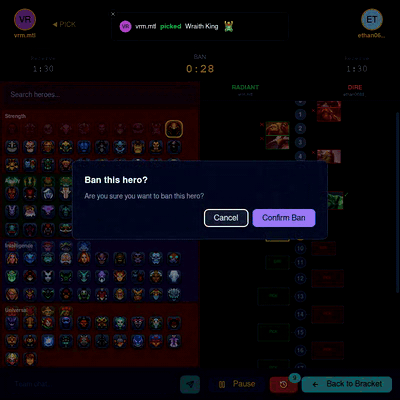
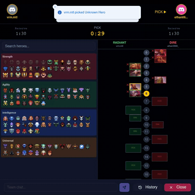
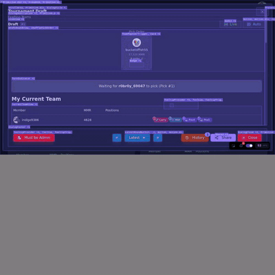
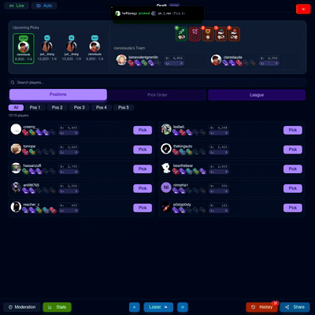

# Draftforge

A tournament management platform for Dota 2 gaming communities.

**Website:** [dota.kettle.sh](https://dota.kettle.sh)

**Documentation:** [kettleofketchup.github.io/DraftForge](https://kettleofketchup.github.io/DraftForge/)

## Features

- **Tournament Management** - Create and manage tournaments with customizable formats
- **Draft System** - Three draft styles: Snake, Normal, and Shuffle (MMR-balanced)
- **Hero Draft** - Captains Mode hero picking with real-time WebSocket updates
- **Team Organization** - Captain-based team drafting with live updates
- **Match Tracking** - Steam API integration for match statistics
- **League System** - Player ratings and league standings
- **Discord Integration** - OAuth authentication and bot notifications
- **Telemetry** - Structured logging with structlog and optional OpenTelemetry tracing

## Screenshots

| Home | Tournaments | Tournament Detail | Bracket |
|------|-------------|-------------------|---------|
|  |  |  |  |

## Demo Videos

Automated demo recordings are available for key features:

| Captain 1 - HeroDraft | Captain 2 - HeroDraft |
|-----------------------|-----------------------|
|  |  |

| Shuffle Draft | Snake Draft |
|---------------|-------------|
|  |  |

### Generate Demos Locally

```bash
source .venv/bin/activate

# Record all demos and generate GIFs
inv demo.quick

# Or record individually
inv demo.shuffle     # Shuffle draft
inv demo.snake       # Snake draft
inv demo.herodraft   # Hero draft with bracket
```

Full videos: `docs/assets/videos/` | GIF previews: `docs/assets/gifs/`

## Tech Stack

| Layer | Technologies |
|-------|--------------|
| Frontend | React 19, TypeScript, Vite, TailwindCSS, Radix UI |
| Backend | Django 5, Django REST Framework, Daphne (WebSockets), Celery |
| Infrastructure | Docker, Nginx, Redis (caching) |
| Observability | structlog, OpenTelemetry (opt-in) |
| Auth | Discord OAuth |

## Quick Start

```bash
# Clone the repository
git clone https://github.com/kettleofketchup/draftforge.git
cd draftforge

# Setup Python environment
python -m venv .venv
source .venv/bin/activate
poetry install

# Start development environment
inv dev.debug
```

## Development

Full development documentation is available at [kettleofketchup.github.io/DraftForge](https://kettleofketchup.github.io/DraftForge/), including:

- [Installation Guide](https://kettleofketchup.github.io/DraftForge/getting-started/installation/)
- [Quick Start](https://kettleofketchup.github.io/DraftForge/getting-started/quick-start/)
- [Architecture Overview](https://kettleofketchup.github.io/DraftForge/architecture/overview/)
- [API Reference](https://kettleofketchup.github.io/DraftForge/api/endpoints/)
- [Draft System](https://kettleofketchup.github.io/DraftForge/features/draft/)
- [Hero Draft](https://kettleofketchup.github.io/DraftForge/features/herodraft/)
- [Telemetry](https://kettleofketchup.github.io/DraftForge/dev/telemetry/)

### Docker Images

Build and push Docker images using Invoke tasks:

```bash
# Build all images
inv docker.all.build

# Push all images
inv docker.all.push
```

Version is managed in `pyproject.toml`.

### GitHub Container Registry

Authenticate to push images:

```bash
echo YOUR_GITHUB_PAT | docker login ghcr.io -u YOUR_GITHUB_USERNAME --password-stdin
```
