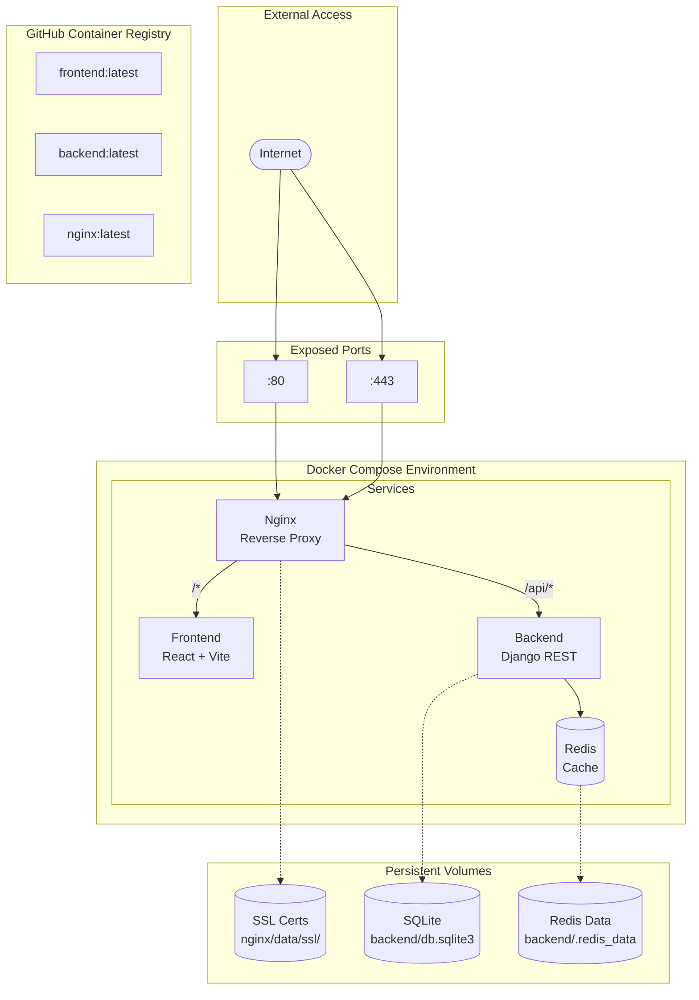

# Docker Architecture

## Overview



## Docker Compose Configurations

The project provides multiple Docker Compose configurations for different environments:

| File | Purpose | Use Case |
|------|---------|----------|
| `docker-compose.debug.yaml` | Development | Local development with hot reload |
| `docker-compose.test.yaml` | Testing | Cypress E2E testing |
| `docker-compose.prod.yaml` | Production | Production deployment |
| `docker-compose.release.yaml` | Release | Versioned release deployment |

## Services

### Frontend Service

```yaml
frontend:
  image: ghcr.io/kettleofketchup/dota_tournament/frontend:latest
  # Development: mounts ./frontend/ for hot reload
  volumes:
    - ./frontend/:/app
```

- **Dev Image**: `frontend-dev:latest` - Includes dev dependencies
- **Prod Image**: `frontend:latest` - Optimized production build

### Backend Service

```yaml
backend:
  image: ghcr.io/kettleofketchup/dota_tournament/backend:latest
  depends_on:
    - redis
  volumes:
    - ./backend/:/app/backend
```

- **Dev Image**: `backend-dev:latest` - Debug mode enabled
- **Prod Image**: `backend:latest` - Production optimized

### Redis Service

```yaml
redis:
  image: redis:8.2.1-alpine
  volumes:
    - ./backend/.redis_data:/data
```

Persistent data storage for cache across restarts.

### Nginx Service

```yaml
nginx:
  image: ghcr.io/kettleofketchup/dota_tournament/nginx:latest
  ports:
    - "80:80"
    - "443:443"
  volumes:
    - ./nginx/default.template.conf:/etc/nginx/templates/
    - ./nginx/data/ssl/:/etc/letsencrypt/live/dota.kettle.sh/
```

## Environment Files

| File | Description |
|------|-------------|
| `docker/.env.dev` | Development environment variables |
| `docker/.env.test` | Test environment variables |
| `docker/.env.prod` | Production environment variables |
| `docker/.env.release` | Release version and settings |

## Image Registry

All images are hosted on GitHub Container Registry:

```
ghcr.io/kettleofketchup/dota_tournament/
├── frontend:latest
├── frontend-dev:latest
├── backend:latest
├── backend-dev:latest
└── nginx:latest
```

## Common Docker Operations

```bash
source .venv/bin/activate

# Build all images
inv docker.all.build

# Push to registry
inv docker.all.push

# Pull latest images
inv docker.all.pull

# Start development
inv dev.debug
```

## Environment Management

Each environment (dev, test, prod) has consistent docker compose commands:

### Development
```bash
inv dev.up        # Start dev environment
inv dev.down      # Stop and remove containers
inv dev.logs      # Follow container logs
inv dev.ps        # List running containers
inv dev.restart   # Restart services
inv dev.exec backend bash  # Shell into backend
```

### Testing
```bash
inv test.up       # Start test environment
inv test.down     # Stop and remove containers
inv test.ps       # List running containers
```

### Production
```bash
inv prod.up       # Start prod environment
inv prod.down     # Stop and remove containers
inv prod.logs     # Follow container logs
inv prod.ps       # List running containers
```

## Networking

### Development Network
Services communicate via Docker's default bridge network.

### Test Network
Creates an isolated `test-network` for E2E testing:

```yaml
networks:
  test-network:
    driver: bridge
```

## Volume Mounts

### Development Volumes
- Source code mounted for hot reload
- Database files persisted locally

### Production Volumes
- Only database and SSL certificates mounted
- No source code access

## SSL Certificates

Development uses self-signed certificates in `nginx/data/ssl/`.

Production uses Let's Encrypt via Certbot:
```bash
inv prod.certbot
```
