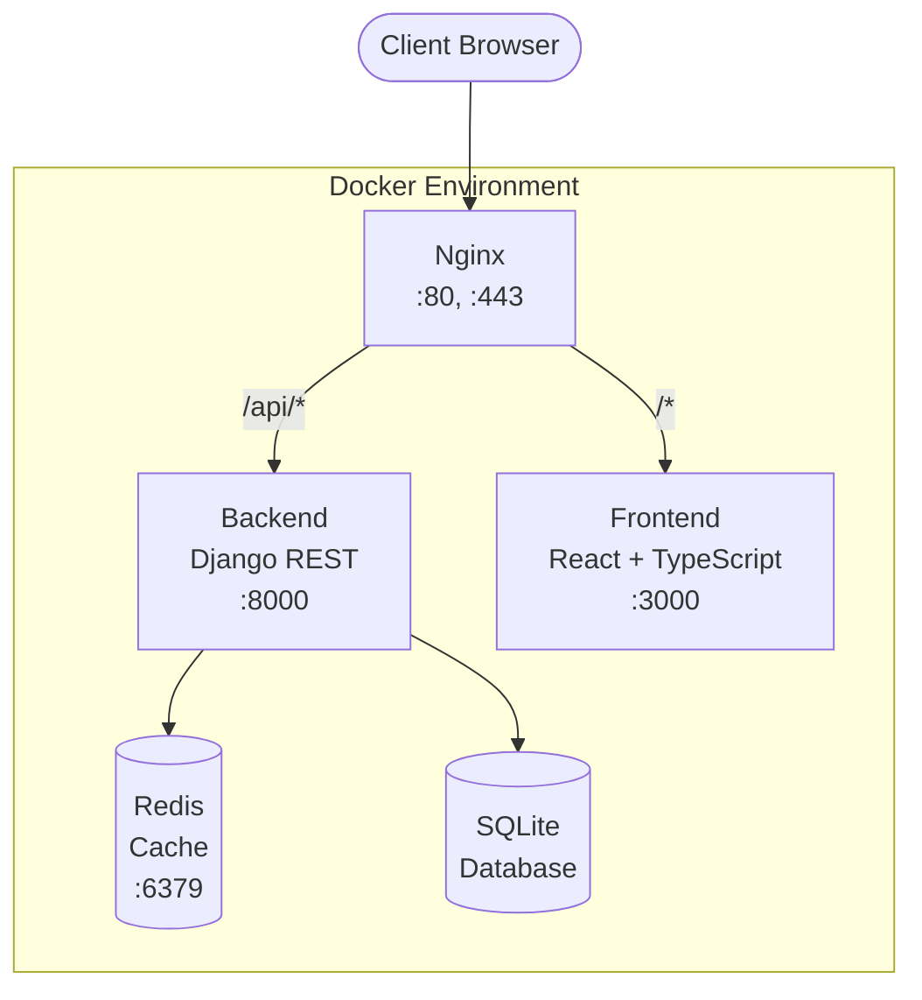
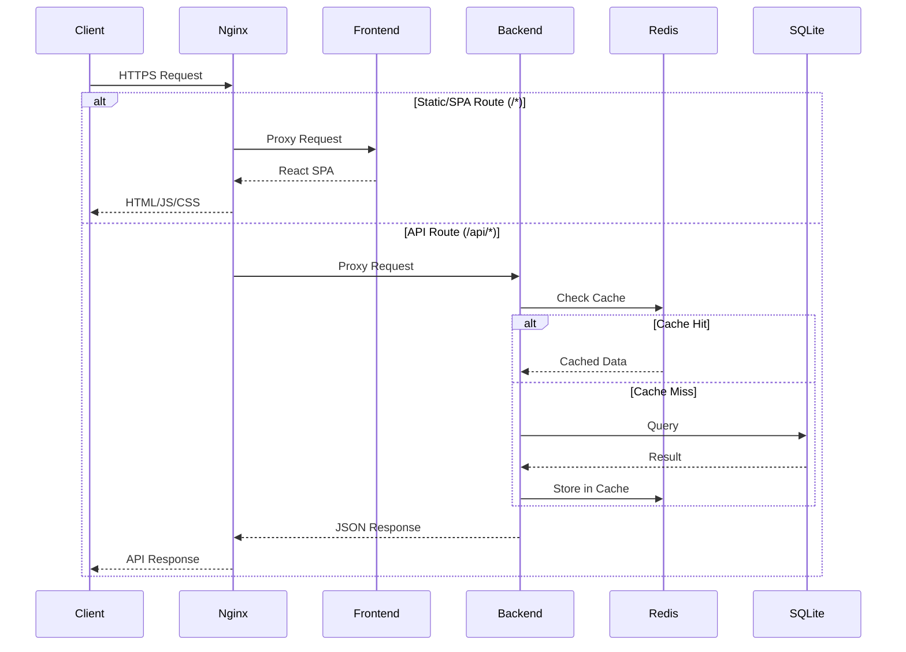
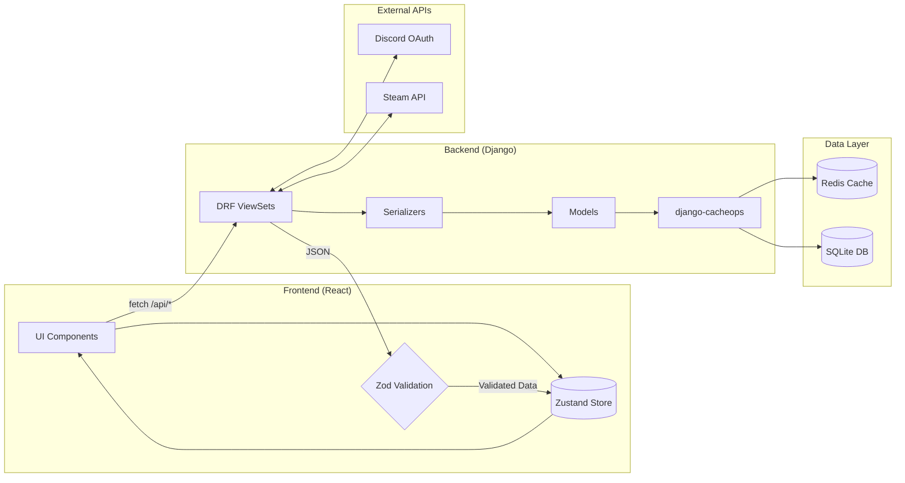

# Architecture Overview

DraftForge follows a modern full-stack architecture with clear separation of concerns.

## High-Level Architecture



## Request Flow



## Data Flow



## Service Responsibilities

### Nginx
- SSL termination
- Reverse proxy routing
- Static file serving
- Load balancing (future)

### Frontend
- Server-Side Rendering (SSR) with React Router 7
- User interface rendering
- Client-side state management
- API consumption

#### SSR API Configuration

The frontend uses SSR (Server-Side Rendering) for improved performance and SEO. During SSR, API requests are made from the Node.js server inside the Docker container, not from the browser.

**How it works:**

- **Client-side (browser):** Uses `/api` - proxied by Nginx to the backend
- **Server-side (SSR):** Uses `SSR_API_URL` environment variable

**Configuration:**

The `SSR_API_URL` environment variable controls where the frontend server makes API requests during SSR:

| Deployment | SSR_API_URL |
|------------|-------------|
| Docker Compose (default) | `http://backend:8000/api` |
| Kubernetes | `http://backend-service:8000/api` |
| External backend | `https://api.example.com/api` |
| Local dev (no Docker) | `http://localhost:8000/api` |

Set in your environment file (e.g., `docker/.env.dev`):

```bash
SSR_API_URL=http://backend:8000/api
```

!!! note "Docker Service Names"
    In Docker Compose, services can reach each other by service name. The `backend` in the URL refers to the backend service defined in `docker-compose.yaml`.

### Backend
- REST API endpoints
- Business logic
- Authentication (Discord OAuth)
- Database operations
- Steam API integration

### Redis
- Session storage
- Query caching (django-cacheops)
- Rate limiting data
