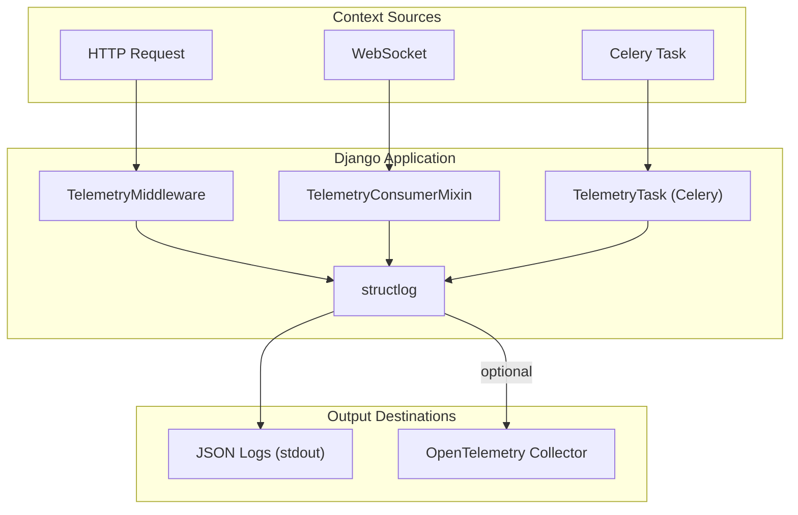
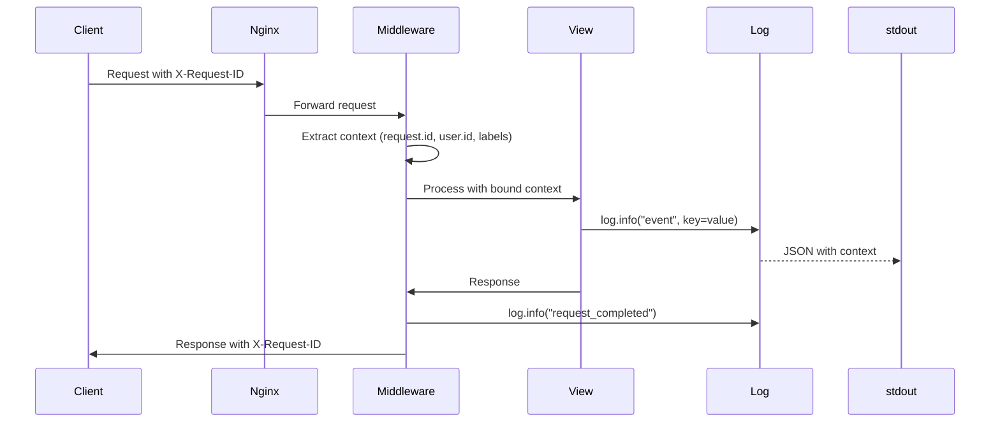
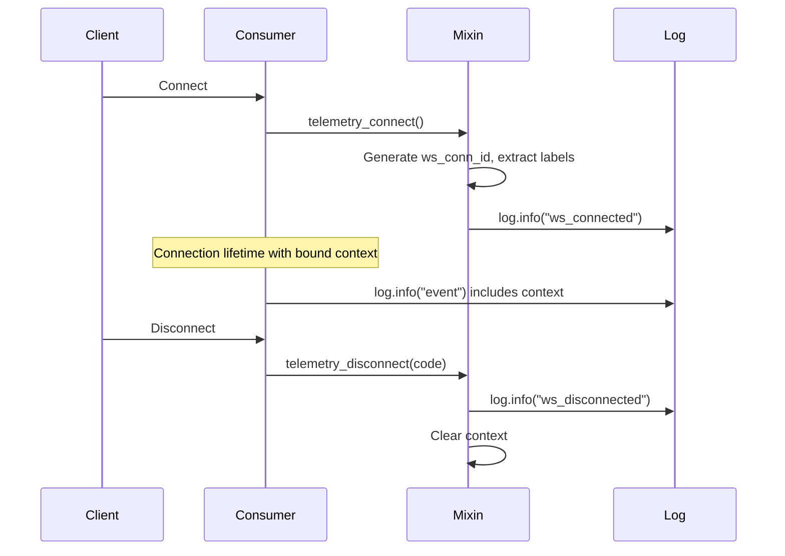
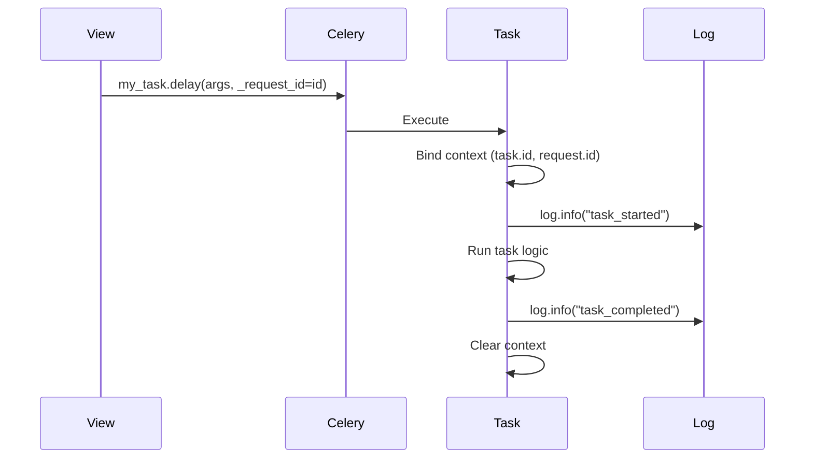

# Telemetry Architecture

This document describes the architecture of the DTX telemetry system.

## Overview



## Components

### Config (`telemetry/config.py`)

Central initialization point that:

- Reads environment variables
- Configures structlog format (JSON vs pretty)
- Initializes OpenTelemetry if enabled
- Provides `init_telemetry()` called at Django startup

### Logging (`telemetry/logging.py`)

Structured logging configuration:

- Uses structlog with stdlib logging integration
- JSON output in production, colored pretty output in development
- Automatic context variable merging
- Quiets noisy third-party loggers

### Middleware (`telemetry/middleware.py`)

Django middleware that:

- Generates or accepts `X-Request-ID` header
- Extracts user ID from authenticated sessions
- Extracts labels from URL paths
- Binds context for request duration
- Logs request completion with timing

### Labels (`telemetry/labels.py`)

URL-based label extraction:

- Parses resource patterns from API and WebSocket paths
- Extracts resource IDs (tournament.id, draft.id, etc.)
- Returns context dict for log enrichment

### WebSocket (`telemetry/websocket.py`)

Mixin for Django Channels consumers:

- Generates unique connection IDs
- Extracts labels from WebSocket paths
- Binds context for connection duration
- Logs connect/disconnect events

### Celery (`telemetry/celery.py`)

Base task class for Celery:

- Binds task.id and task.name context
- Supports request context propagation
- Logs task lifecycle events

### Tracing (`telemetry/tracing.py`)

Optional OpenTelemetry integration:

- OTLP exporter for distributed tracing
- Django auto-instrumentation
- Configurable sampling rate

## Data Flow

### HTTP Request Flow



### WebSocket Flow



### Celery Task Flow



## Design Principles

### 1. Context Propagation

All context is propagated via `structlog.contextvars`:

- Automatically included in every log within scope
- Thread-safe via Python contextvars
- Cleared on scope exit to prevent leaks

### 2. Opt-in Complexity

- Logging works out of the box
- OpenTelemetry requires explicit enablement
- Progressive enhancement without breaking changes

### 3. Semantic Field Names

Fields follow OpenTelemetry semantic conventions:

- `request.id` - Request identifier
- `user.id` - User identifier
- `http.method` - HTTP method
- `http.status_code` - Response status
- `task.id` - Celery task ID

### 4. Minimal Performance Impact

- JSON serialization is deferred
- Context binding uses efficient contextvars
- Sampling reduces tracing overhead

## Log Output Examples

### Development (pretty format)

```
2024-01-15 10:23:45 [info     ] request_completed  [telemetry.middleware] http.method=GET http.route=/api/tournaments/5/ http.status_code=200 duration_ms=12.34 request.id=abc-123 user.id=42 labels=['tournament'] tournament.id=5
```

### Production (JSON format)

```json
{
  "timestamp": "2024-01-15T10:23:45.123456Z",
  "level": "info",
  "logger": "telemetry.middleware",
  "event": "request_completed",
  "http.method": "GET",
  "http.route": "/api/tournaments/5/",
  "http.status_code": 200,
  "duration_ms": 12.34,
  "request.id": "abc-123",
  "user.id": 42,
  "labels": ["tournament"],
  "tournament.id": 5
}
```
