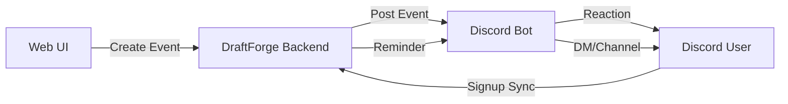

# Discord Integration

Automated event management with Discord bot integration for tournament signups and announcements.

!!! info "GitHub Issue"
    [#52 - Tournaments page and discord bot integration](https://github.com/kettleofketchup/DraftForge/issues/52)

## Overview

Organizations can link their Discord server to DraftForge, enabling automatic event creation, user signups via Discord reactions, and scheduled announcements/reminders.

---

## Features

### Organization Discord Linking

- Organizations store a Discord server ID in the backend
- Links DraftForge organization to their Discord community

---

### Events System

Register events through the web UI, associated with a League:

| Field | Description |
|-------|-------------|
| Discord Channel ID | Where the event will be posted |
| Tournament Start DateTime | When the tournament begins |
| Event Post DateTime | When the Discord event gets posted |
| Tournament Name | Name displayed on website |
| Event Post Name | Name displayed in Discord |
| Event Description | Markdown content (sanitized with nh3) |

**Discord Interaction:**

- Green checkmark to sign up for tournament
- X to remove registration
- Interacting with Discord automatically registers users on the website

---

### Announcements and Reminders

Discord event reminders that notify users before events. Can have multiple, one, or no reminders.

| Field | Description |
|-------|-------------|
| Discord Channel ID | Where announcement is posted (optional) |
| Direct Message Option | Send to users as DMs |
| Time Delta | Time before tournament (30 minutes, 2 days, etc.) |
| Markdown Content | Announcement text (sanitized with nh3) |

---

## Data Flow

---

## Security

- All markdown content sanitized using `nh3` for safe format escaping
- Discord channel IDs validated against organization's server
- Bot permissions scoped to necessary actions only

---

## Acceptance Criteria

- [ ] Organizations can link Discord server ID
- [ ] Events can be created via web UI
- [ ] Events post to specified Discord channel
- [ ] Discord reactions register/unregister users
- [ ] Reminders sent at configured intervals
- [ ] Direct message option works
- [ ] Markdown content properly sanitized
