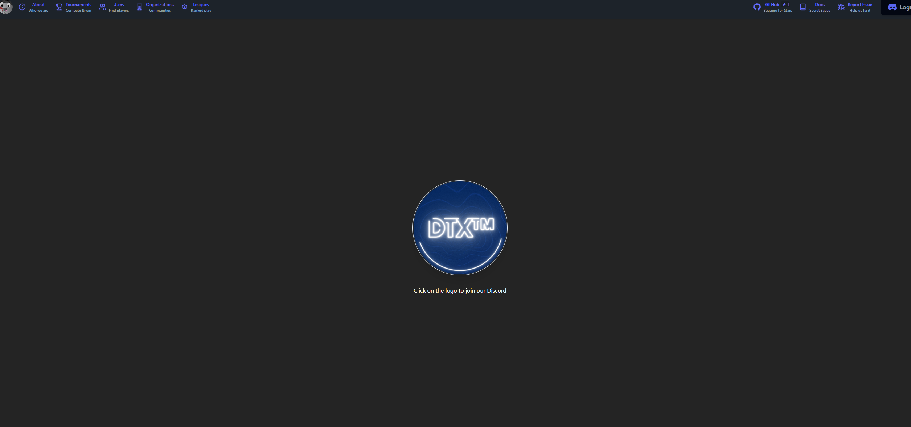
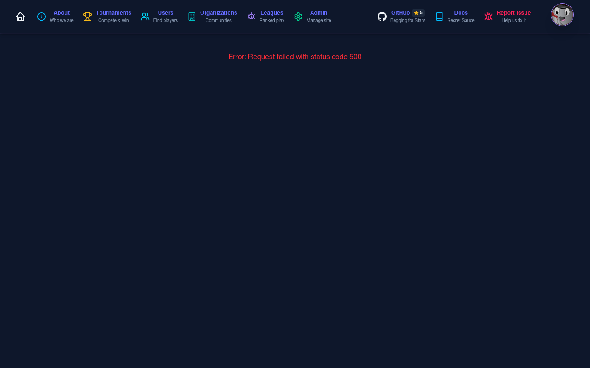
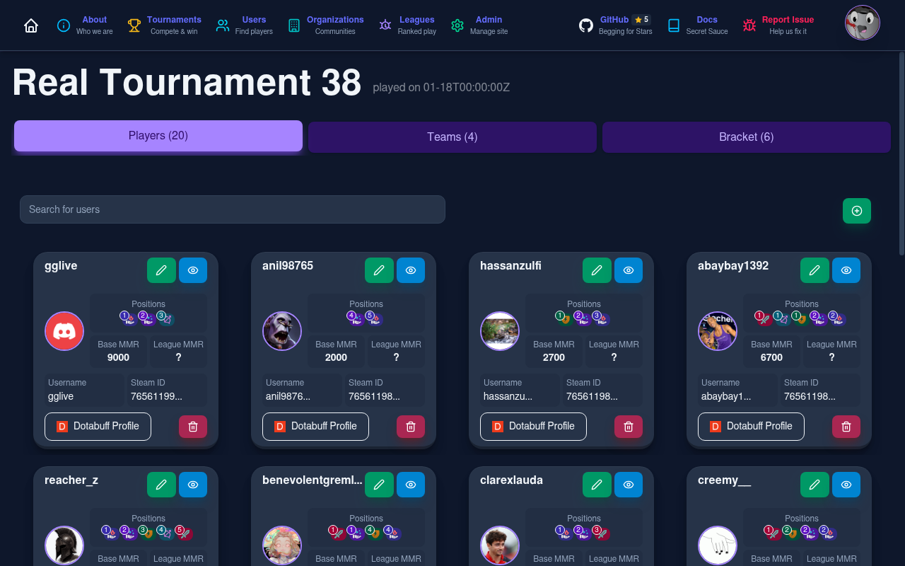
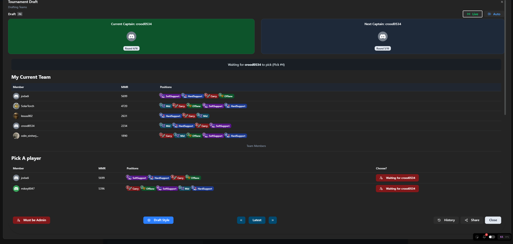
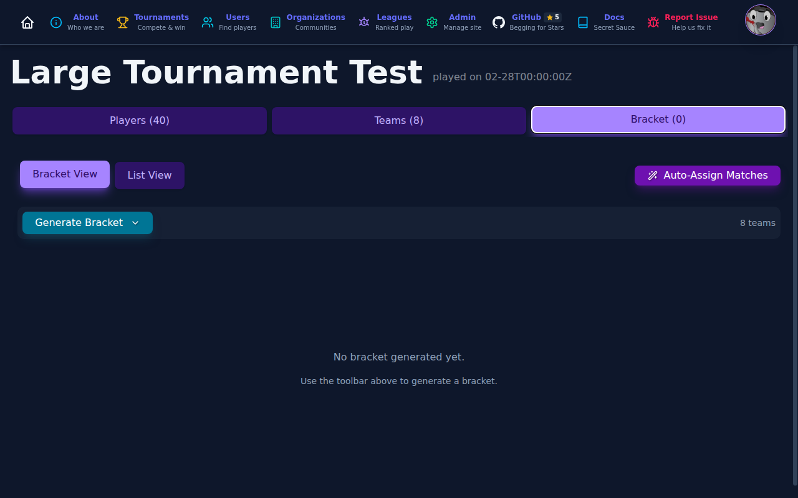
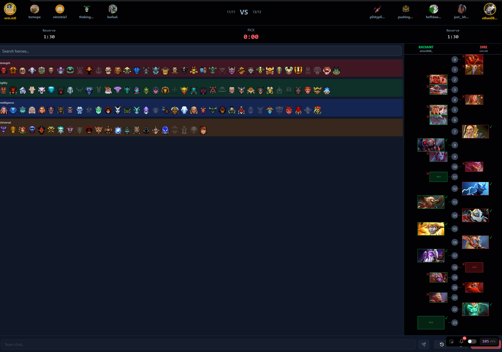

# DraftForge Documentation

Welcome to the DraftForge documentation. DraftForge is a platform for managing Dota 2 tournaments, teams, and competitive gaming.

## Overview

DraftForge is a full-stack application for managing:

- **Users** - Discord-integrated user management
- **Tournaments** - Tournament creation and management
- **Teams** - Team organization and drafting
- **Games** - Match tracking and statistics

## Screenshots

<div class="grid cards" markdown>

| Home | Tournaments |
|------|-------------|
|  |  |

| Tournament Detail | Player Draft |
|--------------------|--------------|
|  |  |

| Bracket | Hero Draft |
|---------|------------|
|  |  |

</div>

## Tech Stack

| Layer | Technologies |
|-------|-------------|
| **Frontend** | React, TypeScript, Vite, TailwindCSS, Shadcn UI |
| **Backend** | Django, Django REST Framework, Redis |
| **Infrastructure** | Docker, Nginx, GitHub Container Registry |
| **Observability** | structlog, OpenTelemetry (opt-in) |
| **Authentication** | Discord OAuth via django-social-auth |

## Quick Links

- [Installation Guide](getting-started/installation.md)
- [Quick Start](getting-started/quick-start.md)
- [Docker Architecture](architecture/docker.md)
- [Invoke Tasks](development/invoke-tasks.md)

## Features

- [Draft System](features/draft.md) - Snake, Normal, and Shuffle draft modes
- [Hero Draft](features/herodraft.md) - Captains Mode hero banning and picking

## Demo Recordings

Generate demo videos and GIFs of key features:

```bash
source .venv/bin/activate

# Record all demos and generate GIFs
inv demo.quick

# Or record individually
inv demo.shuffle     # Shuffle draft
inv demo.snake       # Snake draft
inv demo.herodraft   # Hero draft with bracket
```

See [Demo Tasks](development/invoke-tasks.md#demo-tasks-inv-demo) for all options.

## Project Structure

```
website/
├── backend/          # Django REST API
├── frontend/         # React + TypeScript + Vite
├── docker/           # Docker Compose configurations
├── nginx/            # Nginx reverse proxy config
├── scripts/          # Invoke task scripts
└── docs/             # This documentation
```
